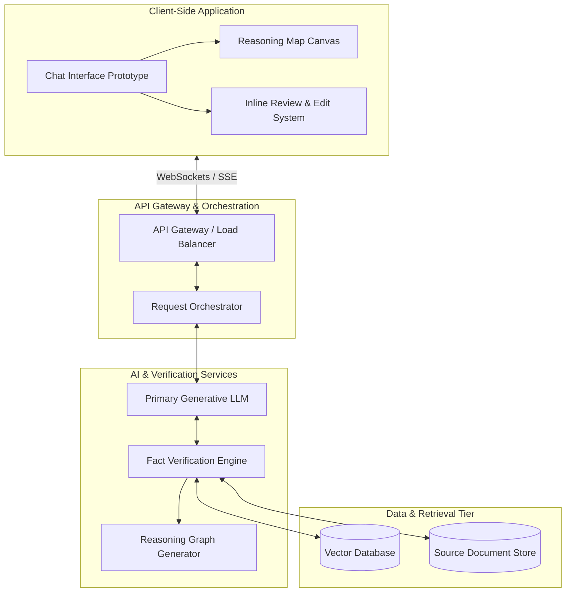
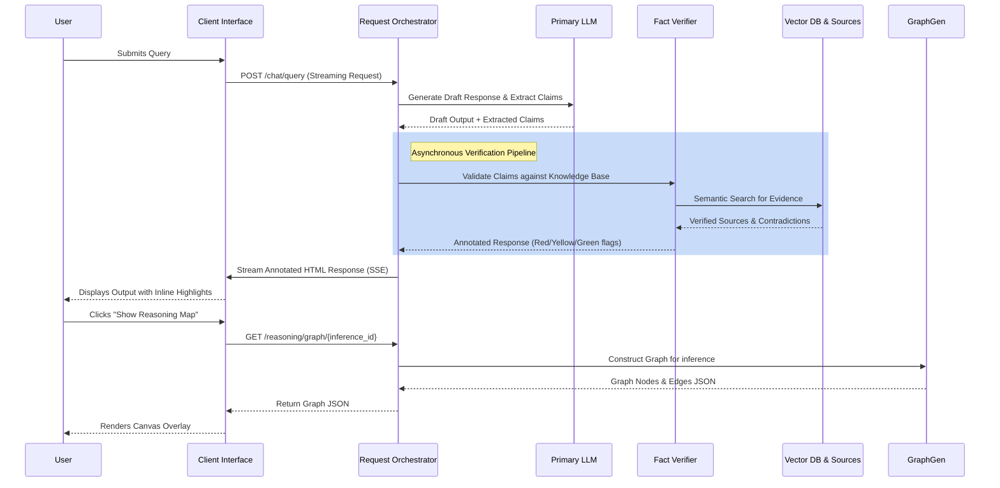

# System Architecture: Review & Reasoning Application

This document outlines the proposed full-stack architecture required to power the dynamic features demonstrated in the ChatGPT Review & Reasoning frontend prototype.

## High-Level Architecture Diagram

The system follows a modern microservices architecture, utilizing a Retrieval-Augmented Generation (RAG) pipeline combined with a specialized verification engine.

## Component Breakdown

### 1. Client-Side Application (Frontend)
*   **Chat Interface:** Handles user input, multi-turn conversational context, and streams the incoming HTML tokens.
*   **Inline Review & Edit System:** Parses the annotated HTML stream. Handles the state management for flags (red, yellow, green), interactive tooltips, and the "Compare" module to track user edits against original responses.
*   **Reasoning Map Canvas:** A dynamic layout engine that calculates positions and renders the D3-style graphs showing the relationships between inferences and their underlying sources.

### 2. API Gateway & Orchestrator
*   **API Gateway:** Manages rate limiting, authentication, and maintains persistent Server-Sent Events (SSE) connections with the client for streaming responses.
*   **Request Orchestrator:** The "traffic cop" that takes the user's prompt, passes it to the LLM, and intercepts the output to run it through the Verification Engine before streaming it back to the client.

### 3. AI & Verification Services
*   **Primary Generative LLM:** Generates the initial draft response and extracts key inferences/claims that need checking.
*   **Fact Verification Engine:** The core of the review system. It takes the LLM's claims, queries the Vector DB for semantic matches, and evaluates the evidence. It annotates the draft text with confidence scores:
    *   `[Green]`: Verified Data
    *   `[Yellow]`: Inferred / Anecdotal Data
    *   `[Red]`: Unverified / Contradictory Data
*   **Reasoning Graph Generator:** A microservice that structures the verification results into a logical node/edge JSON graph representing the logical steps taken to reach an inference.

### 4. Data & Retrieval Tier (RAG)
*   **Vector Database:** (e.g., Pinecone, Weaviate) Stores high-dimensional embeddings of all verified source material for rapid semantic similarity search.
*   **Source Document Store:** (e.g., S3, MongoDB) Holds the raw text and metadata (author, date, URL) of the source documents so the UI can display exact quotes and citations in the right sidebar.

---

## Data Flow Sequence

The following sequence diagram illustrates the step-by-step data flow when a user submits a prompt, demonstrating how the backend orchestrates the verification process and streams the results to the UI.

